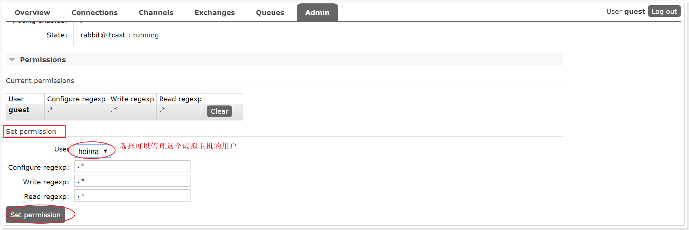

# RabbitMQ的安装和配置

- [使用Docker安装RabbitMQ](#使用docker安装rabbitmq)
- [开启管理界面及配置](#开启管理界面及配置)
- [启动](#启动)
- [配置虚拟主机及用户](#配置虚拟主机及用户)
    - [用户角色](#用户角色)
    - [Virtual Hosts配置](#virtual-hosts配置)

## 使用Docker安装RabbitMQ
https://registry.hub.docker.com/_/rabbitmq/?tab=description
```sh
$ docker run -d --hostname my-rabbit --name some-rabbit rabbitmq:management
```
以下的命令均是直接在Linux系统上直接安装使用的。

## 开启管理界面及配置

```sh
# 开启管理界面
rabbitmq-plugins enable rabbitmq_management

# 修改默认配置信息 
vim rabbitmq/lib/rabbitmq_server-3.6.5/ebin/rabbit.app 
# 比如修改密码、配置等等，例如：loopback_users 中的 <<"guest">>，替换为guest
```

## 启动

```sh
systemctl start rabbitmq-server  # 启动服务
systemctl stop rabbitmq-server  # 停止服务
systemctl restart rabbitmq-server  # 重启服务
systemctl status rabbitmq-server
```

设置配置文件

```shell
cd /usr/share/doc/rabbitmq-server-3.6.5/

cp rabbitmq.config.example /etc/rabbitmq/rabbitmq.config
```

启动rabbitmq

~~~~shell
cd /usr/lib/rabbitmq/lib/rabbitmq_server-3.6.5/ebin
 
rabbitmq-server start &
~~~~

常用命令

~~~~shell
  rabbitmq-server -deched  --后台启动节点
 
  rabbitmqctl stop_app --关闭节点上的应用
 
  rabbitmqctl start_app --启动节点上的应用
 
  rabbitmqctl stop --关闭节点
~~~~


> 修改了用户名之后，重启服务器造成创建用户丢失：
>
> 因为rabbitmq数据是根据当前hostname作为node节点作为数据名保存，这一点可以从rabbitmq-env文件中可以看出。
>
> 解决方案：
>
> 1. 不要更改hostname
> 2. https://blog.csdn.net/qq_27037443/article/details/78050526

## 配置虚拟主机及用户

### 用户角色

RabbitMQ在安装好后，可以访问`http://ip地址:15672` ；其自带了guest/guest的用户名和密码；如果需要创建自定义用户；那么也可以登录管理界面后，如下操作：

 


这里的Tags为用户的权限，说明如下：

**角色说明：**

1、 超级管理员(administrator)

可登陆管理控制台，可查看所有的信息，并且可以对用户，策略(policy)进行操作。

2、 监控者(monitoring)

可登陆管理控制台，同时可以查看rabbitmq节点的相关信息(进程数，内存使用情况，磁盘使用情况等)

3、 策略制定者(policymaker)

可登陆管理控制台, 同时可以对policy进行管理。但无法查看节点的相关信息(上图红框标识的部分)。

4、 普通管理者(management)

仅可登陆管理控制台，无法看到节点信息，也无法对策略进行管理。

5、 其他

无法登陆管理控制台，通常就是普通的生产者和消费者。

### Virtual Hosts配置

`像mysql拥有数据库的概念并且可以指定用户对库和表等操作的权限。RabbitMQ也有类似的权限管理；`在RabbitMQ中可以虚拟消息服务器Virtual Host，每个Virtual Hosts相当于一个相对独立的RabbitMQ服务器，每个VirtualHost之间是相互隔离的。exchange、queue、message不能互通。 相当于mysql的db。Virtual Name一般以/开头。

> 创建Virtual Hosts


> 设置Virtual Hosts权限



